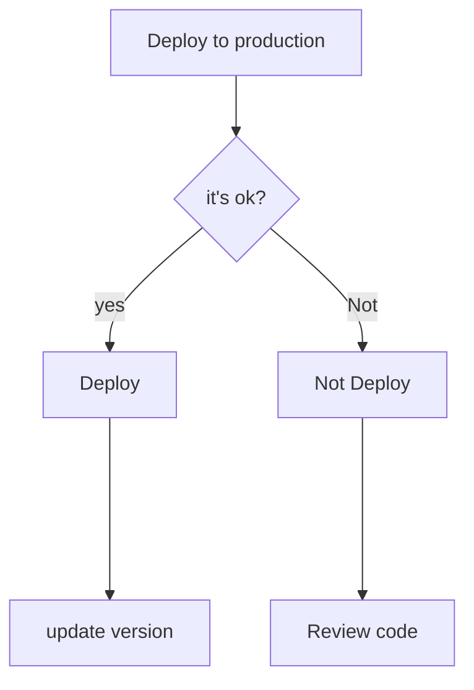

# Icons

## badges

- [x] Language: markdown
- [x] Editor: VS Code
- [x] svg source: img.shield

> custom profesional badges
>
## Author

 <!-- twitter -->
 <!-- linkedin -->
<!-- medium -->
 <!-- github -->
 <!-- vagrant -->
 <!-- docker -->

 <!-- codersrank -->
 <!-- hackerrank -->
<!-- Behance -->
<!-- website -->

> soft skills badges

<!-- skill badges -->

> languages profesional badges

<!-- c -->
<!-- c++ -->
<!-- python-->
<!-- java -->
<!-- ruby -->
<!-- r -->
<!--HTML5-->
<!-- CSS3 -->
<!-- JS -->
<!-- TS -->
<!-- jquery -->
<!-- Markdown -->
<!-- sql -->
<!-- php -->
<!-- VBA --><!-- no logo-->
<!-- MAKEFILE -->

> environment badges

<!-- ubuntu -->
<!-- kali linux -->
<!-- bash -->
<!-- vim -->
<!-- vs code -->
<!-- atom -->
<!-- pycharm -->
<!-- clion -->
<!-- git -->
<!-- github -->
<!-- vagrant -->
<!-- docker -->
<!-- jupyter -->
<!-- colab -->
<!-- mysql -->
<!-- Node.js -->
<!-- npm -->
<!-- Postgres -->
<!-- MongoDB -->

> style and standardss

<!-- semistandard -->
<!-- eslint -->
<!-- w3 validator -->
<!-- Betty style -->
<!-- pep8 -->
<!-- pycodestyle -->
<!-- shellcheck -->

> Networking/Cloud

<!-- AWS -->
<!-- Github Pages -->
<!-- Docker Compose -->
<!-- Kubernetes -->
<!-- Gunicorn -->
> Frameworks

<!-- front end -->

<!-- Bootstrap -->
<!-- tailwind.css -->
<!-- React.js -->
<!-- Angular.js -->
<!-- Font Awesome -->

<!-- AI --                    >
<!-- tensorflow -->

<!-- open on colab -->

> technical skills

- flask
- jinja
- linear algebra
- probabilities

> Backend

- pip

<!-- Django -->
<!-- Next.js -->

> Server

<!-- Nginx -->

> Machine learning

<!-- conda --><!-- no logo-->
<!-- numpy -->
<!-- pandas -->
<!-- matplotlib --><!-- no logo-->
<!-- scikitlearn -->
<!-- opencv -->
> Mermaid

> Miscelanious

- <!-- Codepen.io -->

> QA

<!-- jest -->
<!-- pytest -->

> UX-UI

<!-- Figma -->
<!-- XD -->
<!-- Illustrator -->
<!-- Photoshop -->
